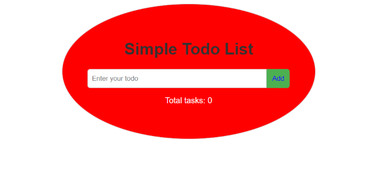
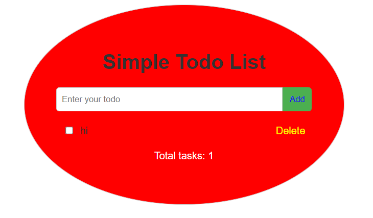
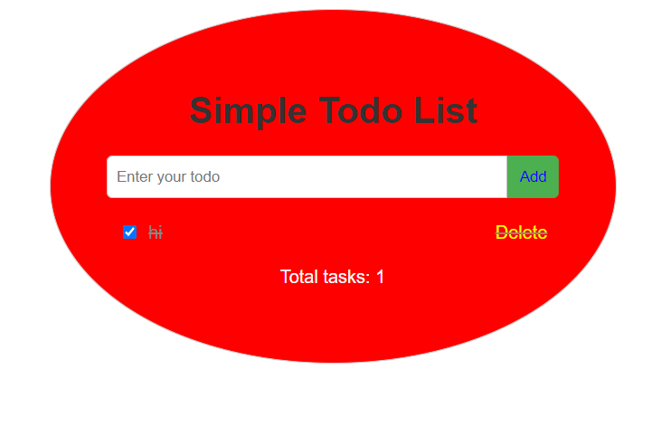
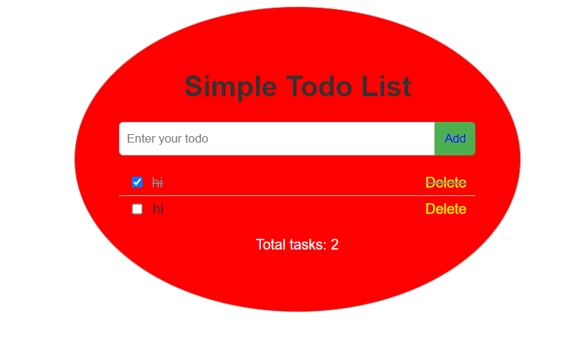
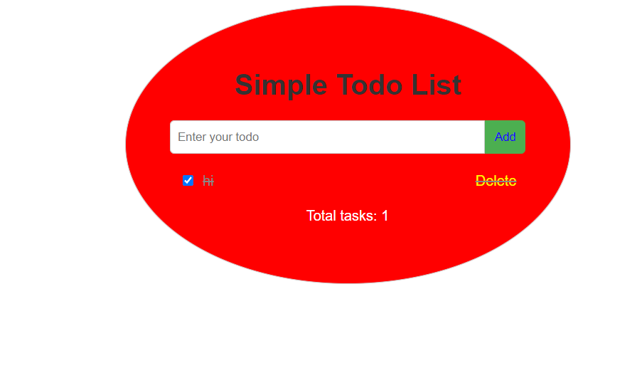

# Simple Todo List Website
This repository contains a simple Todo List web application built using HTML, CSS, and JavaScript. It allows users to add, delete, and mark tasks as completed. The tasks are displayed in a user-friendly interface with dynamic updates for the total number of tasks.

### Features
* A text box at the top to add a todo item to the list.
* Add button: when a user clicks on the button, add that todo item to the list.
* A delete button to delete the todo item completely from the list.
* A checkbox to check the item off the list.
* Total number of tasks in the list.

### How to Use
1. Clone or download this repository to your local machine.
2. Open the index.html file in your web browser to access the Todo List web application.
3. Add a text to the input box
4. Click the add button -> The task will be added to the list
5. Check the completed task -> The task will be striked out.
6. Uncheck the competed task -> The task is not striked out.
7. Delete the task - > the task is removed from the list

Screenshots

Dependencies
No external dependencies are required to run this application. It is a self-contained front-end web application.

Contributing
If you find any issues or have suggestions for improvements, feel free to open an issue or submit a pull request.

License
This project is licensed under the MIT License.

Acknowledgments
The Todo List web application was developed as a simple demonstration of basic front-end web development concepts. It was created for educational purposes and to showcase the use of HTML, CSS, and JavaScript to build interactive web applications.